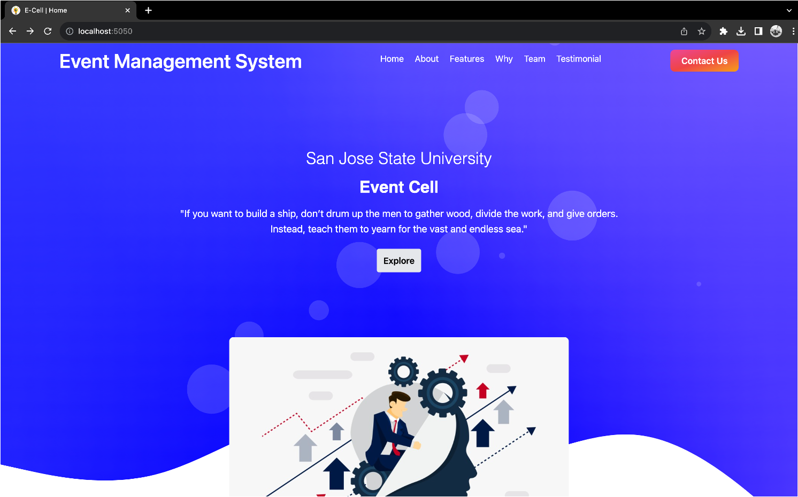
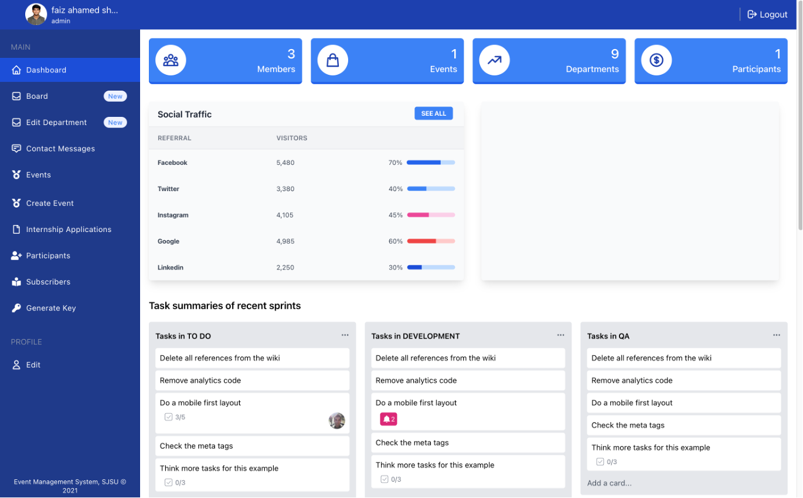

# 🎓 Campus Orbit

Campus Orbit is a university event management platform designed to help students stay connected with on-campus events. The application supports event creation, participation tracking, admin moderation, and even real-time communication, making it an all-in-one platform to enhance campus engagement.

---

## 🚀 Features

### ✅ Core Functionality
- User registration & JWT-based authentication
- Event creation and participation tracking
- Admin panel for managing events and users
- Integration with Google Sheets and Gmail API
- Real-time chat functionality for event discussions
- Email notifications for event confirmations

### 🎨 Frontend
- Built using **EJS** for server-side rendering
- Responsive design with **Tailwind CSS**
- Intuitive UI for browsing, registering, and managing events
- Dynamic views for login, dashboard, and user profiles

### 🧠 Backend
- **Node.js + Express.js** backend with MVC architecture
- **MongoDB** for storing user and event data
- Secure APIs protected via JWT middleware
- Modular structure with controllers, routes, models, services, and utils
- Google API integrations for Sheets and Gmail
- Event logging and auto-email confirmations
- Chat system and middleware-based access control

---

## 🛠️ Tech Stack

| Area        | Technology                   |
|-------------|------------------------------|
| Frontend    | EJS, Tailwind CSS            |
| Backend     | Node.js, Express.js          |
| Database    | MongoDB                      |
| Auth        | JWT                          |
| APIs        | Google Sheets, Gmail API     |
| Styling     | Tailwind CSS                 |
| Other       | Socket.IO (for chat), Docker (optional)

---

## 📁 Project Structure
```
Campus-Orbit/
├── bin/                  # Entry script to start the server
├── common/               # Shared constants or utilities
├── Controllers/          # Handles business logic for each route
├── model/                # MongoDB models (schemas)
├── public/               # Static files like images, JS, CSS
├── routes/               # Route definitions and endpoints
├── scripts/              # Automation or DB-related scripts
├── seeders/              # Sample data and initial DB seeding
├── service/              # Core logic, services consumed by controllers
├── utils/                # Utility functions (tokens, mail, etc.)
├── validation/           # Input validation rules
├── views/                # EJS templates for rendering UI
├── .env                  # Environment configuration
├── app.js                # Main application entry point
└── Dockerfile            # (Optional) Docker config for containerization
```

---

## 🧪 Running Locally

1. Clone the repository:
   ```bash
   git clone https://github.com/Faizahamed-S/Campus-Orbit.git
   cd Campus-Orbit

2. Install Dependencies
    ```
    npm install
    ```
3. Setip environment variables in a .env file:
    ```
    PORT=3000
    MONGO_URI=your_mongodb_connection_string
    JWT_SECRET=your_secret_key
    GOOGLE_CLIENT_ID=your_google_client_id
    GOOGLE_CLIENT_SECRET=your_google_secret
    ```
4. Start the app:
   ```
   npm start
   ```
---
## ⿰ ScreenShots




